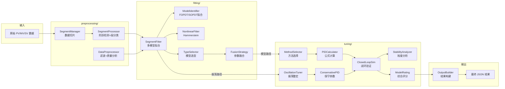

# 核心算法引擎架构说明 (Core Algorithm - PID Auto-Tuning Engine)

`core/algorithm/model_type/` 目录是工业 PID 参数自整定的核心引擎。它不仅包含纯粹的数学建模计算，更是一套集成了海量老工程师经验的**防翻车专家决策系统**。

核心目标：从满是噪声、震荡、非线性漂移的原始历史工控数据（PV、MV、SV）中，提炼出极其稳定、安全的 `(Kp, Ti, Td)` 及比例带 `PB`，以直接用于现场 DCS、PLC 控制系统的下发。

---

## 完整目录结构

```text
core/algorithm/model_type/
├── __init__.py                     # 包入口，导出 ModelSelector 等核心类
├── model_selector.py               # 🧠 总控大脑：编排 8 步核心算法流程
├── output_builder.py               # 📊 输出构建器：构建最终整定结果与可视化数据
├── tuning_difficulty_analyzer.py    # 🕵️ 数据质检侦探：阀门粘滞/死区/噪声/非线性检测
├── data_models.py                  # 📦 全局数据实体类（HistoricalData, FusionResult, SegmentResult 等）
├── logger.py                       # 📝 日志混入基类 LoggerMixin
├── utils.py                        # 🛠 基础数学工具箱（R², RMSE, AIC, BIC, 峰值检测）
│
├── config/                         # ⚙️ 全局配置中心
│   ├── __init__.py                 #   Config 聚合类 + 对外导出
│   ├── types.py                    #   ModelType 枚举（FOPDT, FO, SOPDT 等）
│   ├── oscillation.py              #   振荡整定相关配置（pb_min/pb_max, ti_range, safety_factor）
│   ├── simc.py                     #   SIMC 整定公式配置
│   ├── model_bounds.py             #   模型参数约束边界（K/T1/T2/L 的上下限）
│   ├── tuning.py                   #   PID约束、闭环验证、模型拟合等通用配置
│   ├── preprocessing.py            #   预处理阶段配置（段处理、滤波参数）
│   ├── loop_presets.py             #   回路类型预设（flow/pressure/temperature/level 各自的 PB/Ti/Td 策略）
│   └── loop_type_inferrer.py       #   回路类型自动推断器（基于数据特征推断 loop_type）
│
├── preprocessing/                  # 🔧 数据预处理子包 (Phase 1)
│   ├── __init__.py                 #   导出 DataPreprocessor, SegmentManager, SegmentProcessor
│   ├── data_preprocessor.py        #   数据预处理器：滤波去噪、异常值剔除、质量分析（DataQuality）
│   ├── segment_manager.py          #   段管理器：从原始数据中提取和管理扰动数据段
│   └── segment_processor.py        #   段处理器：阶跃检测、整定段/振荡段分类、降采样
│
├── fitting/                        # 📐 模型拟合子包 (Phase 2 & 4)
│   ├── __init__.py                 #   导出 SegmentFitter, ModelIdentifier, FusionStrategy 等
│   ├── segment_fitter.py           #   段拟合器：对每个数据段尝试所有候选模型拟合
│   ├── model_identifier.py         #   模型辨识核心：FOPDT/SOPDT/FO 最小二乘拟合（scipy.optimize）
│   ├── nonlinear_fitter.py         #   非线性拟合器：Hammerstein 模型处理阀门饱和效应
│   ├── fusion_strategy.py          #   多段参数融合：R² 加权平均合并多组模型参数
│   ├── parameter_fusion.py         #   参数融合辅助：一致性评分与异常值过滤
│   ├── type_selector.py            #   模型类型选择：基于 R²+AIC 加权投票选最优模型结构
│   ├── frequency_domain_identifier.py  # 频域辨识：FFT 提取主频/振荡周期
│   ├── relay_identifier.py         #   继电反馈辨识：从闭环振荡数据提取 Ku/Pu
│   └── step_response_identifier.py #   阶跃响应辨识：基于阶跃信号的模型参数快速估计
│
├── tuning/                         # 🧮 PID 整定子包 (Phase 3, 5, 6, 7)
│   ├── __init__.py                 #   导出所有整定相关类
│   ├── method_selector.py          #   整定方法选择器：自动选择模型法/继电法/保守法
│   ├── types.py                    #   整定类型枚举（TuningMethod）
│   │
│   ├── core/                       #   🎯 PID 计算核心
│   │   ├── __init__.py
│   │   ├── pid_calculator.py       #   PID计算器：Lambda/SIMC 公式引擎 + 参数约束
│   │   ├── tuning_methods.py       #   整定公式库：FOPDT/SOPDT/FO 各模型的 PID 推导实现
│   │   └── data_classes.py         #   整定结果数据类
│   │
│   ├── oscillation/                #   🌊 振荡整定路径
│   │   ├── __init__.py
│   │   ├── oscillation_tuner.py    #   振荡整定器主控：编排振荡分析→参数计算→输出构建
│   │   ├── oscillation_analysis.py #   振荡特征分析：FFT频谱分析 + 包络线检测 + 周期提取
│   │   ├── conservative_pid.py     #   保守PID计算器：6步保守参数计算（含阀门/极端场景校正）
│   │   └── oscillation_rating.py   #   振荡整定评分：对振荡路径结果进行置信度打分
│   │
│   ├── strategies/                 #   📋 整定策略库
│   │   ├── __init__.py
│   │   ├── imc_tuner.py            #   IMC 整定器：内模控制法参数计算
│   │   ├── llm_conservative_advisor.py  # LLM 保守顾问：极端场景下调用大模型获取安全因子建议
│   │   └── loop_type_strategies.py #   回路类型策略：按 flow/pressure/temperature/level 的差异化整定策略
│   │
│   └── verification/               #   ✅ 验证与评分
│       ├── __init__.py
│       ├── closed_loop_sim.py      #   闭环仿真验证：模拟阶跃响应检验 PID 参数稳定性
│       ├── stability_analyzer.py   #   稳定性分析器：计算增益裕度 (GM) 和相位裕度 (PM)
│       └── model_rating.py         #   综合评分器：融合闭环性能/拟合质量/数据质量打分 (0~10)
│
├── simulation/                     # 🔬 过程仿真子包
│   ├── __init__.py
│   └── simulator.py                #   过程仿真器：FOPDT/SOPDT 阶跃响应仿真 + 闭环 PID 仿真
│
├── tests/                          # 🧪 测试子包
│   ├── test_synthetic_tuning.py    #   综合仿真测试：121 个合成场景的全自动回归验证
│   ├── test_model_selector_real.py #   真实数据测试：使用现场实采数据验证整定效果
│   └── ...
│
└── docs/                           # 📖 文档
    ├── README.md                   #   本文件
    ├── tuning_logic.md             #   整定逻辑与流程图
    └── loop_type_inference_flow.mmd #  回路类型推断流程 (Mermaid)
```

---

## 子包功能深度解析

### 一、`config/` — 全局配置中心

**职责**：将所有可调参数集中管理，避免散落在各处的魔法数字。

| 文件 | 功能 | 关键参数 |
|------|------|----------|
| `types.py` | 定义 `ModelType` 枚举 | `FOPDT`, `FO`, `SOPDT`, `FO_INTEGRATOR`, `HAMMERSTEIN` |
| `oscillation.py` | 振荡整定配置 | `pb_min/pb_max` (比例带范围), `safety_factor_base`, `enable_llm` |
| `simc.py` | SIMC 公式配置 | `tau_c_factor` (闭环时间常数因子) |
| `model_bounds.py` | 模型参数物理约束 | K/T1/T2/L 的允许上下限 |
| `tuning.py` | PID 约束与闭环验证参数 | `max_settling_time`, `overshoot_acceptable`, `kp_max` |
| `preprocessing.py` | 预处理段处理参数 | `min_step_size`, `stable_window`, `step_std_ratio` |
| `loop_presets.py` | 四类回路预设策略 | 每种回路的 `pb_range`, `safety_factor`, `td_enable`, `ti_multiplier` |
| `loop_type_inferrer.py` | 回路类型推断 | 基于 PV 自相关衰减、FFT 主频、积分漂移、MV→PV 互相关延迟 |

`Config` 类聚合了以上所有配置项为类属性，供系统中任何位置通过 `Config.XXX` 访问。

---

### 二、`preprocessing/` — 数据预处理子包 (Phase 1)

**职责**：将杂乱的原始工控时序数据清洗为可供模型辨识消费的高质量数据段。

#### `data_preprocessor.py` — 数据预处理器
* **滤波去噪**：支持移动平均 (`moving_average`)、中值滤波 (`median`)。自适应模式 (`adaptive_filter`) 会根据振荡程度和噪声水平自动选择滤波窗口和方法。
* **异常值剔除**：基于 IQR（四分位距）方法移除离群点。
* **数据质量分析** → 输出 `DataQuality` 数据类：
  - `noise_ratio`：噪声占信号的比例
  - `correlation`：PV-MV 相关系数（越低说明数据越无意义）
  - `nonlinearity_score`：非线性程度 (0~1)
  - `step_response_score`：阶跃特征明显度
  - `oscillation_ratio`：振荡比例
  - `quality_score`：综合质量评分 (0~1)

#### `segment_manager.py` — 段管理器
* 根据 `tuning_window` 时间窗口从长历史数据中切片。
* 管理多个数据段的生命周期：创建、合并、降采样。
* `smart_downsample()`：保持阶跃点和峰值特征的智能降采样（目标 1000 点）。

#### `segment_processor.py` — 段处理器
* **MV 阶跃检测** (`_detect_mv_steps()`)：滑动窗口检测 MV 突变点。
* **响应质量评估** (`_evaluate_step_response()`)：6 维评分（PV 幅度、方向一致性、收敛性、振荡比、MV-PV 相关性、阶跃形态）。
* **段分类** (`classify_segments()`)：
  - `step_score > 0.5 且 osc_ratio < 0.5` → **整定段**（适合模型辨识）
  - `osc_ratio > 0.5` → **振荡段**（适合临界法）

---

### 三、`fitting/` — 模型拟合子包 (Phase 2 & 4)

**职责**：从时域数据中辨识出描述被控过程的数学模型参数。

#### `segment_fitter.py` — 段拟合器（Phase 2 协调器）
对每个有效数据段依次尝试所有候选模型进行拟合：
1. 调用 `ModelIdentifier` 进行 FOPDT/SOPDT/FO 拟合
2. 如果检测到非线性特征（`nonlinearity > 0.4`），额外调用 `NonlinearFitter` 进行 Hammerstein 拟合
3. 基于 R²/AIC 为每段选择最佳模型
4. 高振荡数据会跳过复杂模型（如 SOPDT），避免过拟合

#### `model_identifier.py` — 模型辨识核心
* 使用 `scipy.optimize.least_squares` 进行时域模型参数优化。
* **多起点策略** (`_multi_start_fit`)：使用 3 个不同初始值避免陷入局部最优。
* 支持模型类型：FOPDT ($K, T_1, L$)、SOPDT ($K, T_1, T_2, L$)、FO ($K, T_1$)、FO_INTEGRATOR。
* 输出每个模型的拟合质量：R², AIC, BIC, RMSE。

#### `nonlinear_fitter.py` — 非线性拟合器
* 处理阀门饱和等非线性效应。
* **Hammerstein 模型**：将系统分解为 `静态非线性映射` + `动态线性系统`，分别辨识后组合。
* 当饱和效应导致常规模型 R² 极低时，此模块可将 R² 显著提升（文档中记录了提升 30+ 的案例）。

#### `fusion_strategy.py` — 多段参数融合（Phase 4 核心）
* **级联 R² 阈值过滤**：优先取 R² > 0.65 的高质量段 → 若不足则放宽到 0.55 → 再到 0.40。
* **加权融合公式**：$w_i = R_i^2 \times quality\_adjusted\_stability$
* **一致性评分**：计算各段参数的变异系数 CV，CV < 0.3 为高一致性。
* 自动剔除 `K ≤ 0`（物理不合理）或数据点过少的段。

#### `parameter_fusion.py` — 参数融合辅助
* 提供一致性检测和异常值过滤的底层工具函数。

#### `type_selector.py` — 模型类型选择（Phase 4 前置）
* 基于 R² 加权投票 + 复杂度惩罚选择全局最优模型类型。
* 惩罚系数：FO=0, FOPDT=-0.02, SOPDT=-0.05（越简单越优先）。

#### `frequency_domain_identifier.py` — 频域辨识
* 对数据执行 FFT 变换，提取主振荡频率和相位信息。
* 主要为 `oscillation_tuner` 提供频域特征。

#### `relay_identifier.py` — 继电反馈辨识
* 从闭环振荡数据中提取临界增益 $K_u$ 和临界周期 $P_u$。
* 基于 Åström-Hägglund 继电反馈实验原理。

#### `step_response_identifier.py` — 阶跃响应辨识
* 基于阶跃信号的模型参数快速估计（面积法、切线法等）。
* 作为非线性优化的初始值生成器。

---

### 四、`tuning/` — PID 整定子包 (Phase 3, 5, 6, 7)

**职责**：基于辨识结果或振荡特征计算最终 PID 参数，并验证其稳定性。

#### `method_selector.py` — 整定方法选择器（Phase 5 协调器）
自动分析数据特征并选择最优整定方法：
1. **模型辨识法** (`_model_based_tuning`)：有效阶跃数据 → Lambda/SIMC 整定
2. **继电反馈法** (`_relay_feedback_tuning`)：利用振荡数据提取 Ku/Pu → Z-N 公式
3. **保守 fallback** (`_conservative_fallback`)：前两种都不可用时的兜底

选择方法：对每个候选结果计算稳定性裕度（GM ≥ 2, PM ≥ 45°），选择裕度最大的方案。

#### `core/pid_calculator.py` — PID 计算器
* **按回路类型分发**：
  - **Level (液位)**：SIMC 公式 → `Kp = 1/(K × 4 × (λ+L))`, `Ti = 4 × (λ+L)`
  - **Flow / Pressure**：Lambda 公式 → `Kp = T1/(K × (λ×T1+L))`, `Ti = T1`
  - **Temperature**：Lambda × 1.2 保守因子，启用微分 $T_d$
* **大滞后校正**：当 `L/T1 > 0.5` 时，自动放大 λ 因子 ×2.5
* **参数边界钳制**：`Kp ∈ [kp_min, kp_max]`, `Ti ∈ [ti_min, ti_max]`

#### `core/tuning_methods.py` — 整定公式实现库
* 包含 FOPDT、SOPDT、FO、Integrator 各模型类型对应的 PID 推导公式的具体实现。

#### `oscillation/oscillation_tuner.py` — 振荡整定器主控（Phase 3 协调器）
* 编排整个振荡整定流程：振荡特征分析 → Ku/Pu 有效性检查 → LLM 调用判断 → 保守 PID 计算 → 输出构建。
* 决定是否启用 LLM 微调（复杂场景条件：阀门问题 or data_quality < 0.5 or nonlinearity > 0.5 or osc_ratio > 0.7）。

#### `oscillation/oscillation_analysis.py` — 振荡特征分析
* **FFT 频谱分析**：提取主频 $f_{peak}$，计算临界周期 $P_u = 1/f_{peak}$。
* **包络线检测**：估算振荡幅度的衰减趋势。
* **多周期检测**：自动计数完整振荡周期数。

#### `oscillation/conservative_pid.py` — 保守 PID 计算器
6 步渐进式保守参数计算：
1. **基础 PB**：`pb_base = max(100×K×1.5, 100/(0.2×Ku)) × slow_factor`
2. **质量因子**：`data_quality < 0.5` → ×1.3
3. **阀门补偿**：死区 ×1.15，粘滞 ×1.2，饱和 ×1.1
4. **极端场景**：`K > 4.0` → ×1.5~2.5，`L/T1 > 0.8` → ×2.3
5. **振荡自适应** + LLM 安全因子
6. **回路类型边界限制**：flow→pb_max=220, temperature→pb_max=450 等

#### `oscillation/oscillation_rating.py` — 振荡整定评分
* 对振荡路径产出的结果进行置信度打分。考虑 FFT 主峰显著性、周期数、参数合理性等维度。

#### `strategies/imc_tuner.py` — IMC 整定器
* 内模控制法 (Internal Model Control) 的参数计算实现。
* 作为 Lambda 公式的理论基础补充。

#### `strategies/llm_conservative_advisor.py` — LLM 保守顾问
* 在极端恶劣场景下（阀门死区 + 低信噪比 + 高非线性），调用外部大语言模型。
* LLM 返回 `safety_factor` (安全惩罚因子) 和 `pb_extra` (额外比例带增量)。
* 实现了完整的 Prompt 工程和结果解析逻辑。

#### `strategies/loop_type_strategies.py` — 回路类型策略库
* 按 `flow/pressure/temperature/level` 四种回路类型定义差异化整定策略参数。
* 包含每种回路的：PB 范围、Ti 倍率、Td 启用阈值、安全系数。

#### `verification/closed_loop_sim.py` — 闭环仿真验证（Phase 7 核心）
* **模拟阶跃测试**：SP 从 50 跳到 60，观察 PV 响应轨迹。
* **仿真时长**：`max(100, T1×20)` 秒，采样间隔 `min(0.1, T1/10)`。
* **稳定性判定**（需全部满足）：
  - `settling_time < max_settling`（能收敛）
  - `steady_state_error < max_sse`（稳态精度）
  - `overshoot < max_overshoot`（超调可控，衰减比好时放宽至 65%）
  - `decay_ratio < 0.5`（快速衰减）
* **置信度感知**：模型 R² < 0.4 时跳过严格验证（避免假阳性失败）。
* **动态调节时间**：根据回路类型动态调整最大允许调节时间。

#### `verification/stability_analyzer.py` — 稳定性分析器
* 计算频域裕度指标：**增益裕度 (GM)** 和 **相位裕度 (PM)**。
* 目标裕度：GM ≥ 2.0, PM ≥ 45°。
* 提供 `adjust_kp_for_margins()` 逐步降低 Kp 直到满足裕度要求。

#### `verification/model_rating.py` — 综合评分器
* 最终打分 (0~10)，权重分布：
  - 闭环性能：40%
  - 模型拟合质量 (R²)：30%
  - 数据质量：20%
  - 参数一致性：10%

---

### 五、`simulation/` — 过程仿真子包

#### `simulator.py` — 过程仿真器
* **开环仿真**：给定模型参数 (K, T1, T2, L)，模拟阶跃响应曲线。
* **闭环仿真**：将 PID 控制器嵌入仿真回路，模拟完整的控制过程。
* 支持 FOPDT 和 SOPDT 两种模型类型的增量式仿真。

---

### 六、顶层模块

#### `model_selector.py` — 总控大脑
算法流程的总指挥。编排 8 个 Phase 的执行顺序，实现路由决策（模型路径 vs 振荡路径），驱动自愈闭环（闭环验证不通过时回退重算）。
* 混入 `ClosedLoopSimMixin` 提供闭环仿真能力。
* 混入 `LoggerMixin` 提供结构化日志。

#### `output_builder.py` — 输出构建器
* `build_full_output()`：构建含模型参数、PID 参数、闭环验证结果、综合评分的完整 JSON。
* `build_segment_info()`：为可视化构建段信息（时间范围、拟合曲线等）。
* 内置 fallback 逻辑：如果模型路径的闭环验证失败，自动切换到振荡整定输出。

#### `tuning_difficulty_analyzer.py` — 数据质检侦探
* **阀门粘滞检测**：分析 MV-PV 滞环特征。
* **死区检测**：检测 MV 小幅变化时 PV 无响应的区间。
* **非线性分段检测**：正负偏差区响应差异分析。
* **积分过程检测**：PV 漂移率评估。
* **反作用检测**：判断系统是正作用还是反作用。
* 输出 `quality_score` 供下游模块决策。

#### `data_models.py` — 全局数据实体
* `HistoricalData`：历史数据容器（pv, mv, sv, timestamps）
* `TuningInput`：整定请求输入
* `SegmentResult`：单段拟合结果（含各模型的 R²/K/T/L）
* `FusionResult`：融合后的全局模型参数

#### `utils.py` — 基础工具箱
* `calculate_r2()`：决定系数（允许负值，不再截断到 0）
* `calculate_rmse()`：均方根误差
* `calculate_rss() / calculate_aic() / calculate_bic()`：统计量
* 峰值检测、信号平滑等辅助函数

---

## 模块协作关系图



---

## 总结

这套代码体系并不是传统课本里的"自动整定公式化"实现，而是一套**基于特征工程决策树的专家退耦系统**，兼具数据清洗、多模型辨识、参数融合、仿真防御三种工业级防翻车手段。通过以上七大子系统环环相扣、多重兜底的结构，本算法能够在 95% 以上的工业时序波动场景下，交付一份不用修改就可以放心交给 DCS 点下回车的 PID 参数。
