# PID Tuning Logic & Flow Architecture

本文档详细描述了本项目核心的 PID 整定算法架构与处理流。本算法是一个**两阶段多路由**的专家系统，能够自适应工业现场的不同数据质量与扰动特征，自动选择最优模型或经验整定路径，从而确保最终输出的 PID 参数既具备优良的控制性能，又具备足够的安全性与鲁棒性。

## 1. 核心设计理念

1. **鲁棒性优先**：工业现场数据往往存在噪声干扰、阀门死区、传感器漂移等问题。算法在多个环节对数据质量（Data Quality）进行评估，并根据质量动态调整**参数保守度（Conservativeness）**。
2. **多路径自适应决策**：不拘泥于单一的数学模型（如一阶加纯滞后）。当基于系统辨识的模型路径不可靠时（极度震荡），系统会自动切换至基于频域分析的**振荡整定路径（Oscillation Tuning）**。
3. **闭环仿真防翻车**：在最终下发参数前，内置一个轻量级的闭环仿真模拟器，验证所推导参数的稳定性（超调、收敛时间），如果不满足则启动退回机制增加参数保守性。

---

## 2. 整体算法流程 (Phases)

算法整体可划分为 8 个核心阶段（Phase）。

### Phase 1: 数据预处理与分类 (Data Preprocessing)
* **切片提取**：基于输入的扰动时间窗口 (`tuning_window`)，从一段长历史数据中提取有价值的时段。
* **无效过滤**：剔除 MV 没有发生变化（没有激励）、PV 死值过多或相关性极低的数据段，这避免垃圾数据导致后续拟合崩溃。
* **特征评估分类**：通过内部的梯度与方差分析算法，自动识别系统在扰动期间究竟是发生了阶跃响应（适合模型辨识），还是引发了持续震荡（适合临界法）。系统将片段分类为：**整定段 (Tuning Segment)** 和 **振荡段 (Oscillation Segment)**。

### Phase 2: 模型拟合与路由分发 (Model Fitting & Routing)
尝试使用多种过程模型对经过过滤的数据进行数学拟合，这包括：
* **FOPDT**：一阶加纯滞后系统（最常用）。
* **FO**：纯一阶系统，无时延。
* **SOPDT**：二阶加纯滞后（如果系统表现出明显的“S”型响应，此模型更精准）。
* **饱和模型**：针对阀门开到头等非线性情况。

**关键决策路由**：
在这个阶段系统会审查全部拟合片段的 R² 分数。如果 R² 大面积低于阈值（如 < 0.35）或者数据显示严重振荡，系统判定模型辨识路线已失效，**触发振荡整定条件**，逻辑将分流至少量数学计算、依靠频域特征提取的 **Phase 3**；否则进入常规模型路径 **Phase 4**。

### Phase 3: 振荡整定路径 (Oscillation Path)
应对复杂挑战性工况（如模型本身就在极限循环的边缘）：
* **FFT 分析提取**：不求时域 K/T/L 参数，直接用傅里叶变换提取主振荡频率（求得临界周期 $P_u$），并粗估临界增益 $K_u$。
* **Z-N 经验法 + 保守度约束**：利用经典的 Ziegler-Nichols 相关法则推导初始参数。
* **智能安全因子与极端修正**：针对如“积分过程”、“极慢系统”、“大时延系统”，算法会自动引入一个乘数降低比例带，或者拉长积分时间。如果在极复杂的异常场景（死区/粘滞/低增益），甚至会引入 LLM 进行微观参数调整建议。

### Phase 4: 模型选择与参数融合 (Model Selection & Fusion)
应对常规具备阶跃激励的数据：
* **结构风险惩罚**：基于 R² 加权投票，越简单的模型（如FO）即使拟合分低一点也会被优先考虑（防过拟合）。
* **多片段参数融合 (`PIDFusionStrategy`)**：工业里往往有正反两拨操作。系统将不同时间段提取出的多个 $K_i, T1_i, L_i$ ，使用数据质量评分和 $R^2$ 结合进行加权平均。
* 在这一步输出融合后的唯一被控对象模型 `Fused Result (K, T1, T2, L)`。若参数不合理，系统依然有 fallback 机制退回 Phase 3。

### Phase 5 & 6: 整定方法选择与 PID 计算
基于计算好的模型对象计算最终 PID 参数：
* **回路类型适配 (`loop_type`)**：这是关键！
  * **液位 (`level`)**：多为积分对象，多采用 SIMC 公式。
  * **流量/压力 (`flow/pressure`)**：响应快、噪声偏大，通常使用 Lambda 定理计算对象，较少启用微分（$T_d$）。
  * **温度 (`temperature`)**：极慢系统大滞后，采用 Lambda + 更偏保守的乘数，常启用微分（$T_d$）。
* **动态保守度调整**：根据原始数据的含噪率、非线性度和模型参数的段间一致性，实时计算得到一个 `conservativeness` (0~1) 指标。此指标决定了实际计算选用在激进法则与极端保守法则中间的哪一个锚点。

### Phase 7: 闭环仿真验证 (Closed-Loop Verification)
安全兜底网：系统内部搭载一个使用 `Fused Result` 构建的数字孪生体。
* 对于待下发的 PID 参数，内部模拟一次设定值（SV）阶跃响应（例如扰动 50 到 60）。
* 抓取仿真轨迹计算控制性能工程指标：**调节时间 (Settling Time)**、**超调量 (Overshoot)**、**衰减比 (Decay Ratio)**、**稳态误差 (SSE)**。
* **自愈循环**：如果参数过激导致数字孪生体内振荡发散或超调超过允许阈值（受具体 `loop_type` 的容忍度管控），则重置保守度（例如乘上 0.5 的安全系数），重新返回 Phase 6 计算，如此最多重试 3 次。

### Phase 8: 决断与报表输出
计算融合所有的表现，为本次推导的参数打**置信度综合评分 (`model_rating`)**，并将推荐的参数 (`Kp, Ti, Td` 以及工程师常用的比例带 `PB`) 构建为标准的 JSON 实体返回。

---

## 3. 算法处理流向图 (Mermaid)

下面是描述这一流转过程的逻辑架构完整试图（支持在各类包含 Mermaid 插件的 Markdown 编辑器和平台上预览）：

```mermaid
%%{init: {'theme': 'dark', 'themeVariables': { 'fontSize': '11px' }}}%%
flowchart TB
    %% ============================================================
    %% 入口
    %% ============================================================
    START[("📥 输入数据<br/>history_data: 历史PV/MV/SV数据<br/>tuning_window: 扰动时间窗口列表<br/>current_pid: 当前PID参数(可选)")] --> P1

    %% ============================================================
    %% Phase 1: 数据预处理
    %% ============================================================
    subgraph P1["Phase 1: 数据预处理 - 从原始数据提取可用于模型辨识的数据段"]
        S1["Step 1: extract_segments()<br/>━━━━━━━━━━<br/>根据tuning_window时间窗口<br/>从history_data中切片提取数据段"]
        
        S1 --> S2["Step 1.3: filter_invalid_segments()<br/>━━━━━━━━━━<br/>过滤无效数据段:<br/>• MV变化范围 ptp(mv) < 0.1 → 无激励信号<br/>• 数据点数 len < 30 → 数据量不足<br/>• PV为0占比 > 20% → 传感器异常<br/>• PV与MV相关性 < 0.1 → 无响应关系"]
        
        S2 --> S3["Step 1.5: detect_tuning_segments()<br/>━━━━━━━━━━<br/>检测MV阶跃变化点，找适合模型辨识的整定段<br/>包含阶跃检测算法与响应质量评估(PV幅度、收敛性、稳态特性)"]
        
        S3 --> S4{{"找到有效整定段?"}}
        S4 -->|"是"| S5["merge_tuning_and_disturbance()<br/>合并整定段与扰动段的重叠窗口<br/>并降采样以便计算"]
        S4 -->|"否"| S5a["使用原始扰动段<br/>并降采样"]
        
        S5 --> S6{{"MV是否有变化?<br/>np.ptp(mv) > 0.1"}}
        S5a --> S6
        S6 -->|"否"| FAIL["❌ 无法进行模型辨识<br/>MV无变化，返回空结果"]
        S6 -->|"是"| S7["Step 1.9: classify_segments()<br/>━━━━━━━━━━<br/>将数据段分类为:<br/>• 整定段(适合模型辨识)<br/>• 振荡段(适合振荡整定)<br/>• 混合段"]
    end

    %% ============================================================
    %% Phase 2: 模型拟合与路由决策
    %% ============================================================
    subgraph P2["Phase 2: 模型拟合与路由 - 尝试多种模型拟合，决定后续计算分流"]
        F1["Step 2: fit_all_segments()<br/>━━━━━━━━━━<br/>尝试多种过程模型拟合:<br/>• FOPDT: 一阶加纯滞后<br/>• SOPDT: 二阶加纯滞后<br/>• FO: 一阶无滞后<br/>• 非线性饱和模型"]
        
        F1 --> F2["检查是否触发振荡整定条件<br/>(拟合效果极差、严重振荡等)"]
        
        F2 --> F3{{"是否触发?"}}
        
        F3 -->|"满足"| OSC["→ 进入振荡整定路径<br/>(Phase 3)"]
        F3 -->|"不满足"| F4["检查是否所有模型拟合都失败"]
        
        F4 --> F5{{"全部拟合失败?"}}
        F5 -->|"是"| F5a["强制使用振荡整定<br/>force=True"]
        F5a --> OSC
        F5 -->|"否"| MODEL["→ 进入模型整定路径<br/>(Phase 4)"]
    end

    S7 --> P2

    %% ============================================================
    %% Phase 3: 振荡整定路径
    %% ============================================================
    subgraph P3["Phase 3: 振荡整定 - 基于闭环振荡数据的临界法整定"]
        O1["analyze_oscillation()<br/>━━━━━━━━━━<br/>FFT频域分析提取:<br/>• 临界周期 Pu<br/>• 临界增益 Ku"]
        
        O1 --> O2{{"是否极度复杂场景触发LLM微调?<br/>(例如阀门有死区、噪声极高)"}}
        
        O2 -->|"满足"| O2a["LLMAdvisor介入<br/>提供安全惩罚与参数建议因子"]
        O2 -->|"不满足"| O2b["使用规则引擎经验律"]
        
        O2a --> O3
        O2b --> O3{{"Ku有效性检查"}}
        
        O3 -->|"异常"| O4["标记为低增益场景<br/>大幅度提高后续整定保守度"]
        O3 -->|"正常"| O5["正常振荡场景"]
        
        O4 --> O6
        O5 --> O6["ConservativePIDCalculator.calculate()<br/>━━━━━━━━━━<br/>计算保守PID参数<br/>结合了回路类型、阀门诊断以及大时延做多重校正约束"]
        
        O6 --> O7["计算 Ti 和 Td 参数"]
        O7 --> O8["构建振荡整定输出"]
    end

    OSC --> P3

    %% ============================================================
    %% Phase 4: 模型选择与参数融合
    %% ============================================================
    subgraph P4["Phase 4: 模型选择与融合 - 从多段信号合并系统真实参数"]
        M1["选择最优模型类型<br/>兼顾拟合精度与模型复杂度"]
        
        M1 --> M2["fuse_parameters()<br/>━━━━━━━━━━<br/>融合多个数据段的模型参数<br/>高R²段赋以高权值，剔除参数不合理片段"]
        
        M2 --> M5["PIDFusionStrategy.fuse()<br/>加权平均获得 K_fused, T1_fused, L_fused"]
        
        M5 --> M6["参数极值打平与一致性评分"]
        M6 --> M8{{"融合参数有效?"}}
        
        M8 -->|"否"| M8a["fallback: 回退至强制振荡整定"]
        M8a --> OSC
        M8 -->|"是"| M9["继续下一步整定"]
    end

    MODEL --> P4

    %% ============================================================
    %% Phase 5: 整定方法选择与 Phase 6: PID参数推导
    %% ============================================================
    subgraph P56["Phase 5 & 6: PID控制律计算"]
        R1["评估系统参数和噪声环境<br/>决定保守度 conservativeness"]
        
        R1 --> C3{{"根据被控对象对象路类型路由<br/>(loop_type)"}}
        
        C3 -->|"level (液位)"| C4["SIMC积分公式推导"]
        C3 -->|"flow / pressure"| C5["Lambda 控制律推导"]
        C3 -->|"temperature (温度)"| C6["Lambda + 1.2倍保守因子"]
        
        C4 --> C7
        C5 --> C7
        C6 --> C7["PID参数合成计算"]
        
        C7 --> C8{{"大滞后系统检测<br/>(时延 L 占据主导)"}}
        C8 -->|"是"| C9["触发大滞后校正规则<br/>大幅削减比例带并拉长积分"]
        C8 -->|"否"| C10["正常应用参数超限约束"]
        
        C9 --> C11
        C10 --> C11["获得待验证的试验性 PID"]
    end

    M9 --> P56

    %% ============================================================
    %% Phase 7: 闭环仿真验证 (防翻车兜底)
    %% ============================================================
    subgraph P7["Phase 7: 内置闭环仿真验证"]
        V0["📥 拉取待定 PID 参数<br/>(来自振荡路线或模型计算路线)"]
        
        V0 --> V1["simulate_closed_loop()<br/>━━━━━━━━━━<br/>在内存中推演闭环阶跃响应"]
        
        V1 --> V2["计算核心工控指标:<br/>settling_time (稳定时间) <br/>overshoot (超调率) <br/>decay_ratio (衰减比)"]
        
        V2 --> V3{{"符合工厂安全裕度与稳定要求?"}}
        
        V3 -->|"是"| V4["✓ 验证通过，确认为最终参数"]
        V3 -->|"否"| V5["增加保守度回炉重推<br/>(通过降低Kp, 放大Ti等形式兜底)<br/>最多允许重试三次"]
        
        V5 --> V6{{"重试次数超限?"}}
        V6 -->|"否"| V1
        V6 -->|"是"| V7["强制使用最保守Fallback参数放弃优化"]
        
        V4 --> V8
        V7 --> V8["结合所有阶段表现，进行最终综合评价打分"]
    end

    O8 --> V0
    C11 --> V0

    %% ============================================================
    %% Phase 8: 输出
    %% ============================================================
    subgraph P8["Phase 8: 结果封装与输出"]
        OUT["输出带有全方位推导依据、图表拟合结果以及模型诊断打分报告的最终JSON实体"]
    end

    V8 --> P8 --> END[("✅ 返回整定结果和报表")]

    %% 样式
    style START fill:#4a9eff,color:#fff
    style END fill:#20c997,color:#fff
    style FAIL fill:#ff4444,color:#fff
    style OSC fill:#ff6b6b,color:#fff
    style MODEL fill:#51cf66,color:#fff
    style V4 fill:#20c997,color:#fff
```

