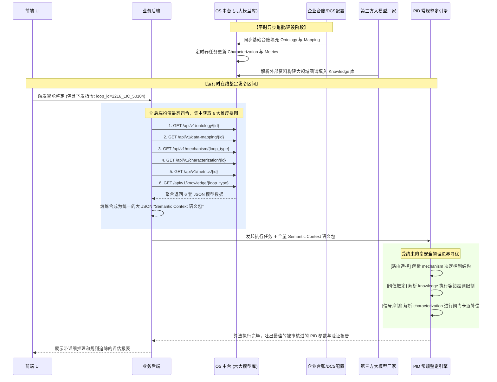

# HolliCube OS 语义层集成与知识图谱架构需求说明书

> **版本**：v1.1  
> **更新日期**：2026-04-09  
> **业务模块**：PID 智能整定 Agent — 语义层(涵盖六大模型)与知识图谱集成  

## 一、 需求概述

当前 PID Agent 已经打通了基于底层 JSON 模拟语义环境的“常规算法整定”以及“大模型辅助整定”的双轨流水线。为了向真正的 HolliCube OS 工业级架构演进，本项目需要实现完整的**语义层（Semantic Layer）全量数据集成**，并对其中最复杂的**知识图谱（Knowledge Graph）**边界进行明确划分。

核心业务逻辑概括为三点：
1. **全景语义层融合**：完整的 PID 调优不仅需要数据，更需要关于控制对象的 6 大维度的全视角画像。这包括：本体、机理、映射、表征、指标以及专家知识。
2. **知识层与能力解耦**：OS 中台负责提供数据的骨架与仓储（数据表与 REST API）。而针对其中最繁琐的知识图谱建设，将交由专门的**第三方大模型厂家**去提炼与加工入库。
3. **“业务后端”的统一封装调度**：由于算法必须要确保纯粹性，所有的 6 大模型数据都必须通过**HolliCube 业务后端系统**统一收口。后端接收到一个回路 ID 后，集中向 OS 拉取这 6 张表的数据包，然后拼凑成统一的 `Context 上下文结构体` 下发给常规整定与大模型整定模块。

---

## 二、 语义层六大模型供给协同矩阵

针对 OS 语义层的这六大子模型，这里明确其归属与源数据供给方，以备各团队对接时对齐口径：

| 模型表名 | 模型定位 | OS 中台如何获取原始数据来源？ (供给方) | 对智能算法整定的指导意义 |
| :--- | :--- | :--- | :--- |
| **1. os_ontology** | **本体模型** (设备物理台账) | 抽取对接工厂现有的 ERP、EAM 及设备管理系统台账。 | 决定了阀心大小、储罐截面积，提供基础物理解析。 |
| **2. os_data_mapping** | **数据映射** (DCS 点位) | 抽取对接底层 DCS 组态或者通讯网关映射表。 | 指导算法从 TSDB 中提取对应的 PV, SP, OP 字段名。 |
| **3. os_mechanism**| **机理模型** (过程物理特性) | 由 PID Agent 提出标准化约束底表，OS 直接固化。 | 它是自然属性铁律，决定了积分、自衡、滞后是否可用特定公式。 |
| **4. os_characterization**| **表征模型** (动态运行特征)| **OS 开发批处理/流计算任务**，每天或者定时算好存库。| 评估现场是否存在阀门卡涩、震荡，用于动态降维与削波。 |
| **5. os_metrics** | **指标模型** (控制绩效 KPI) | **OS 绩效评估模块跑批**，提取自控率、稳态率指标。 | 让推荐引擎得知该回路日常表现，决定是否需要强力介入。 |
| **6. os_knowledge** | **知识模型** (图谱专家经验)| **大模型厂家出人出力** （见下文详述）。| 人类控制专家的护城河，决定了算法生成的参数能否下发现场，不越安全雷池一步。|

---

## 三、 系统层面角色与边界划分

### 1. OS 中台团队（包含六大模型的底座提供方）
* **职责定位**：基础设施研发，扮演 6 大语义表的大管家。
* **具体需求**：
  * 构建能存储以上 6 类结构化与非结构化（知识实体网络）的分布式数据库或图数据库。
  * 按照《数据表结构定义_v1.0》为 6 个模型分别开放高并发查询的 REST API 以供业务后端调用。
  * 提供面向大模型厂家的写操作 API，以支撑他们源源不断地丰富 `os_knowledge` 表。

### 2. 大模型厂家（专攻知识挖掘栈）
* **职责定位**：对 `os_knowledge`（知识模型）负责，专做业务侧难做的“暗知识提取”。
* **具体需求**：
  * **抽取与建模**：解析各类设备的 PDF、操作规程和访谈记录，设计专属工业关系图谱（Ontology for KG）。
  * **结构化落盘**：大模型生成的结果不是泛泛之谈的“生成内容”，他们必须为常规算法提供服务，将提取的规则降解为 `os_knowledge` 表里的严格数值（如强力声明某阀门 `pb_range=[150, 400]`）。
  * **软语境落盘**：保留自然语言规程（如“反应釜忌大幅度波动”），交由 OS 长期保存并直接喂给推理时的 LLM Agent。

### 3. HolliCube 业务后端（“Context 集装箱”装配中心）
* **职责定位**：连接前台请求与底座 OS 平台，隔离常规算法与真实 I/O 的防火墙。
* **具体需求**：
  * **集中式抓取**：当前端发送 `loop_id=50104` 唤醒整定时，后端向 OS 并发请求 `ontology`, `mapping`, `mechanism`, `characterization`, `metrics`, `knowledge` 六大 API。
  * **打包装配**：把上面 6 套返回的 JSON 融合成单个极其庞大、内容饱满的 `Semantic Context`（结构参照给出的 `api_contract_sample.json`）。
  * **任务下发**：将整包的 Context 全量输入给 `TuningOrchestrator`（常规整定引擎的入口）。

### 4. PID Agent 常规整定层（执行引擎）
* **职责定位**：纯粹通过数据计算和输入约束，产生最佳物理推荐。
* **具体需求**：
  * **绝对的数据纯净**：常规管线的代码坚决不对外查询数据库，完全依靠传递进来的六维组合包获取运行世界的长相。
  * **六大模型协同辅助算法**：
    * 提取 * mapping * 得知数据索引。
    * 提取 * mechanism * 确定是否走积分模型专版逻辑。
    * 提取 * knowledge * 作为剪枝约束（如果大模型在图谱中锁死了微分门限，或是约束超调极限）。
    * 最后在此严密框架下，输出绝不出错的安全整定参数。

---

## 四、 运行时数据流时序交互图

为了讲清楚常规整定到底如何被这 6 大模型所服务，业务交互全景如下：

